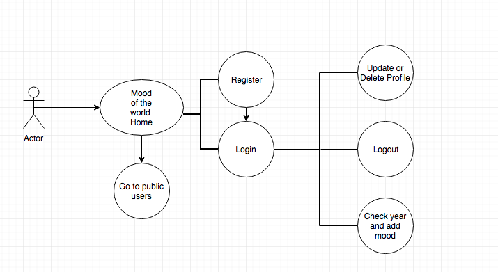

# Mood of the World

## TARGET

This project is the final project for the part time program in Skylab. It is designed in order to check the world's mood at some day.

## TECHNOLOGIES

-----------cambiar esto-----------------------------------
| Transversal | Server-side | Client-side | Testing |
| :---------: |:-------: |:----------: |:---------: |
| | Node.js | React |  |
| javascript (ES5, ES6) | |  |  |
| HTML |  firebase |  |  |

- Other:  Git & Github, Draw.io. 

## Functional description:

Registered users can register each day how they feel, a note and a picture. They can choose to have their profile public or private. If the choose to have it public, it can be showed in home.
In home the data showed in each day is the mood that has more repetitions on that day. If 2 users registered it as happy and one as sad, it would show happy.
Users can update their profile.

### UML Diagram (User Cases)

This are the options for a user:

### DATA MODEL

Here we can see the properties used.

## SCREENSHOTS

### Home 

### Login

### Register

### My mood

### Update profile

## PROJECT LINK

You can see a demo of the project here: [surge](https://singing-lab.surge.sh/#/)

